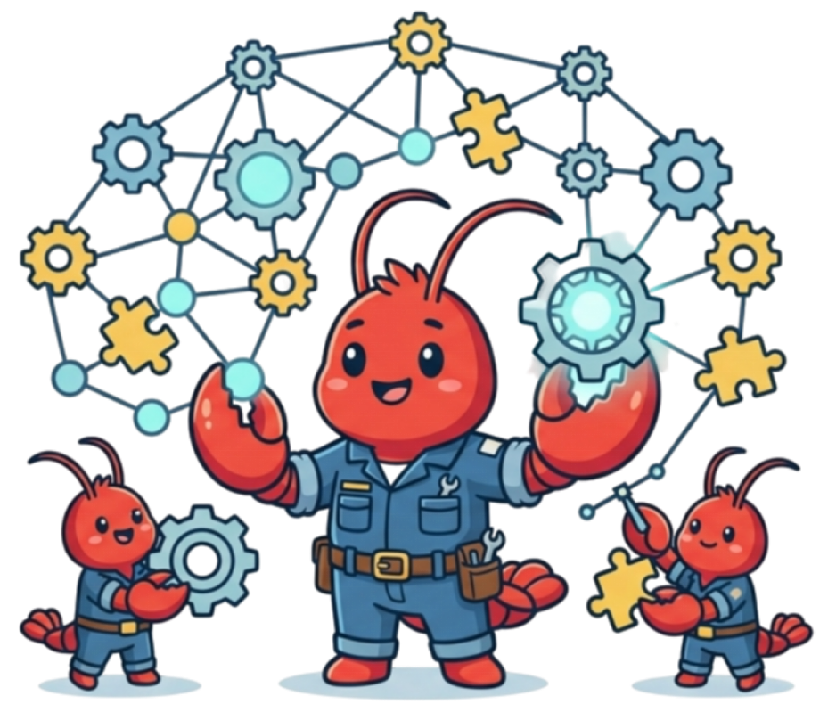
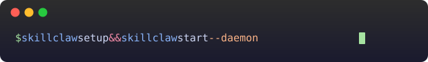
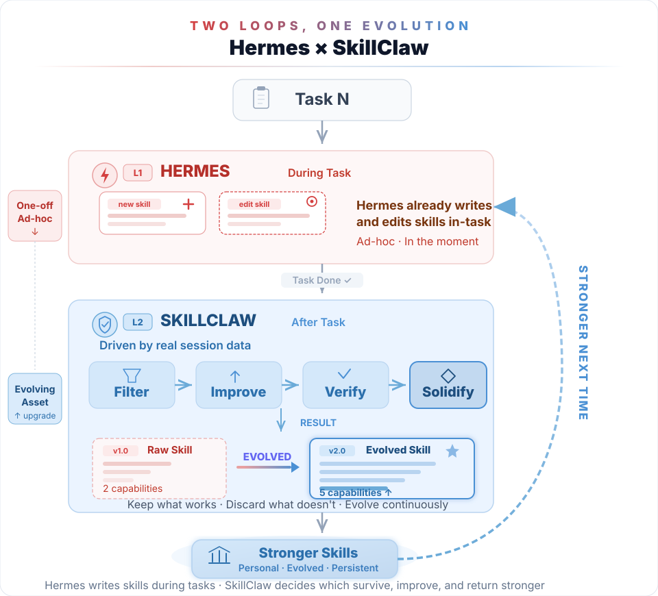
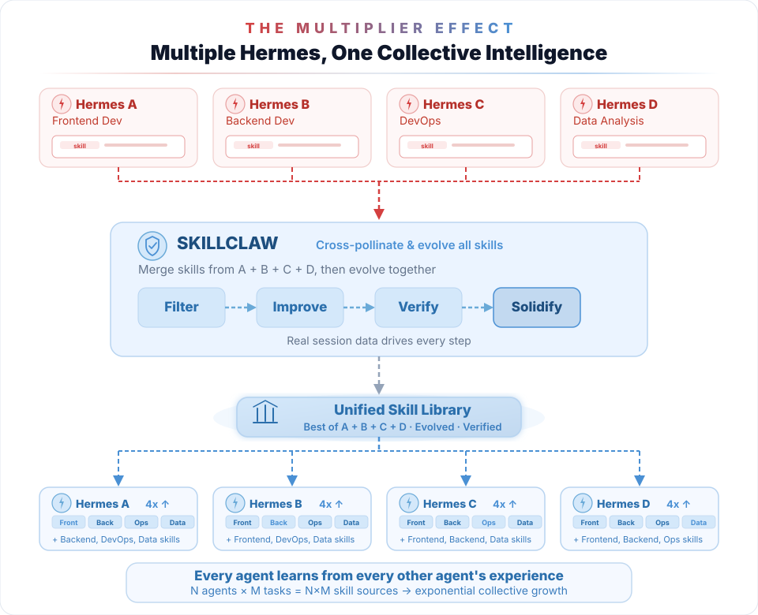
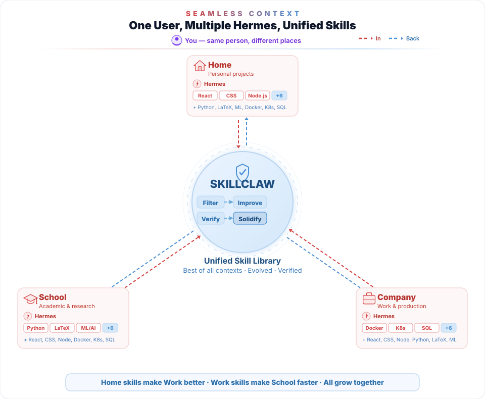
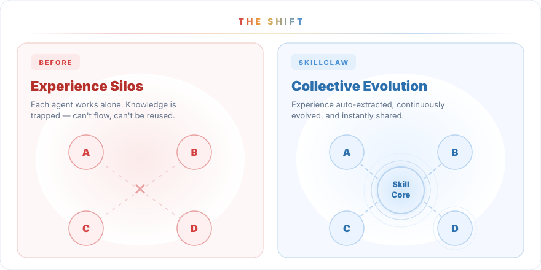
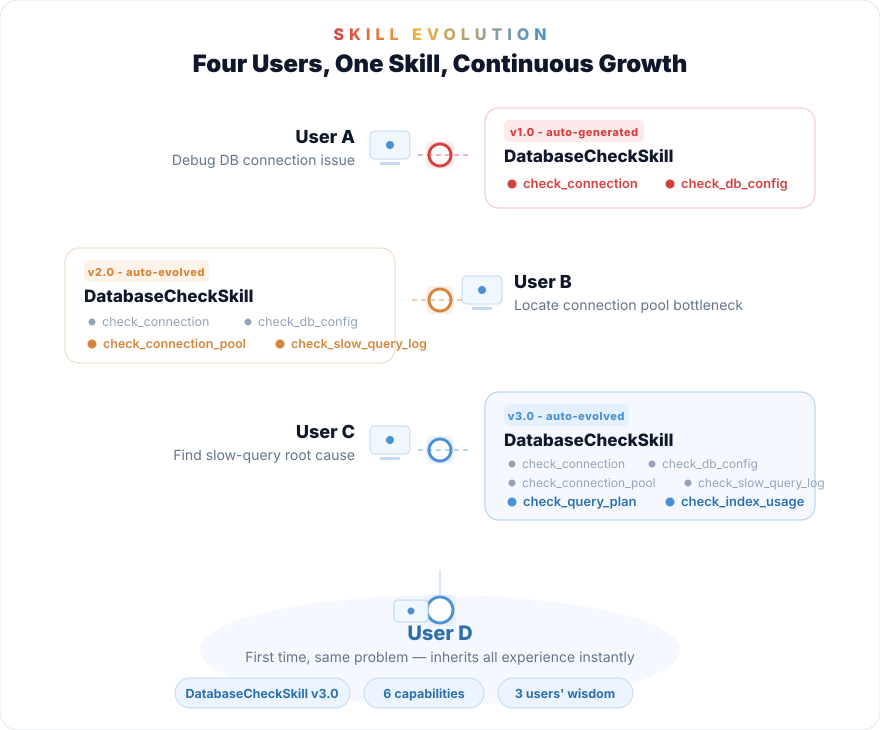
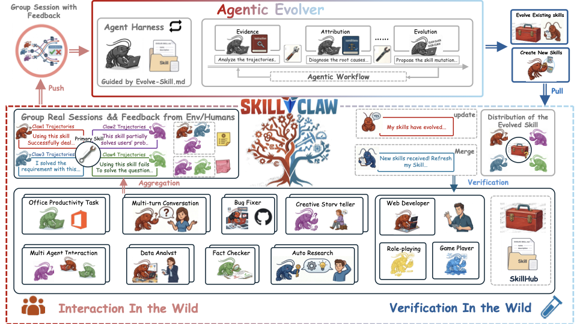

<div align="center">



# ✨ SkillClaw: Let Skills Evolve Collectively with Agentic Evolver ✨

<h3>AI agent skills that evolve from every real interaction — just talk.<br>Across sessions, agents, devices, and users. Experience compounds. Skills keep growing.</h3>

| 🚀 Quick Install | 💬 Just Chat | 🔌 Broad Compatibility | 🧬 Collective Skill Evolution |
|:-:|:-:|:-:|:-:|

[](https://github.com/NousResearch/hermes-agent)
[](https://github.com/openclaw/openclaw)
[](https://github.com/AMAP-ML/SkillClaw)
[](https://www.python.org/)
[](./LICENSE)
[](https://arxiv.org/abs/2604.08377)
[](https://arxiv.org/pdf/2604.08377)
[](https://huggingface.co/papers/2604.08377)
[](assets/image.png)
[](assets/README_ZH.md)

<br>

<a href="https://github.com/AMAP-ML/SkillClaw"></a>



</div>

<br>

<table>
<tr>
<td>🚀 <b>Quick Install</b></td>
<td>Shell installer for macOS/Linux, plus a manual Python install path for Windows. Then run <code>skillclaw setup</code> and <code>skillclaw start --daemon</code>.</td>
</tr>
<tr>
<td>💬 <b>Just Chat</b></td>
<td>Just talk to your agent as usual — skill evolution happens silently in the background. Zero extra effort.</td>
</tr>
<tr>
<td>🔌 <b>Broad Compatibility</b></td>
<td>Natively integrates with <a href="https://github.com/NousResearch/hermes-agent">Hermes</a>, <a href="https://github.com/openai/codex">Codex</a>, <a href="https://docs.anthropic.com/en/docs/claude-code">Claude Code</a>, <a href="https://github.com/openclaw/openclaw">OpenClaw</a>, <a href="https://github.com/agentscope-ai/QwenPaw">QwenPaw</a>, <a href="https://github.com/nearai/ironclaw">IronClaw</a>, <a href="https://github.com/sipeed/picoclaw">PicoClaw</a>, <a href="https://github.com/zeroclaw-labs/zeroclaw">ZeroClaw</a>, <a href="https://github.com/qwibitai/NanoClaw">NanoClaw</a>, <a href="https://github.com/NVIDIA/NemoClaw">NemoClaw</a>, and any OpenAI-compatible API.</td>
</tr>
<tr>
<td>🧬 <b>Collective Skill Evolution</b></td>
<td>Skills evolve from every session, every agent, every context. Solo or team — the loop is the same. Every experience compounds.</td>
</tr>
</table>

---

<div align="center">

## What SkillClaw Brings to One Hermes User

</div>

Been using Hermes for a while — is your skill library still a mess? Duplicates, outdated ones, half-baked ones all piled together like an unsorted loot box. The problem isn't that Hermes doesn't learn enough — it's that nobody helps it **digest**.

**SkillClaw is built for this.** Auto-evolve, auto-deduplicate, auto-improve quality. It won't change how you work or interrupt your flow — it just quietly rewrites your agent's growth curve.

SkillClaw doesn't make Hermes learn more — it makes everything Hermes has learned actually count.

<div align="center">



</div>

That's just one user's story. One user can also run multiple agents or use multiple devices — SkillClaw unifies them all:

<div align="center">

### Multiple agents? One unified skill library.



</div>

Running multiple Hermes agents for different tasks? Without SkillClaw, each builds its own isolated skill silo. With SkillClaw, skills are **merged, deduplicated, and cross-pollinated** into a unified library, then distributed back to all agents. Your Frontend agent's React patterns make the Backend agent's API design better — and vice versa.

<div align="center">

### Multiple devices? Skills follow you, not your machine.



</div>

Same user, different machines. Your Home Hermes learns React; your School Hermes learns ML; your Work Hermes learns K8s. Without SkillClaw, each starts from scratch. With it, **skills unify across all environments** — every Hermes instance benefits from every other's experience, regardless of where you are.

---

<div align="center">

## Collective Skill Evolution

</div>

Everything above is what one user gets. Now scale it up: when you join a shared group, **every team member's real-world experience feeds into the same evolution loop**. User A debugs a database issue — the skill evolves. User B, C, D benefit instantly without ever hitting the same problem. N users, one Skill, continuous evolution.

<div align="center">



<br>



</div>

---

<div align="center">



</div>

---

## News

- **2026/08/06** — We’re excited to announce that [LongHorizon-Harness](https://github.com/AMAP-ML/LongHorizon-Harness) is now open source! It helps agents carry complex, long-horizon computer-use tasks across desktop apps and the CLI with durable state and verified progress. Welcome to follow the project, star the repository, and join the conversation.
- **2026/04/22** — Added a bilingual dashboard with `skillclaw dashboard sync` and `skillclaw dashboard serve` for inspecting local/shared skills, validation progress, version history, and session traces.
- **2026/04/20** — Added [Codex](https://github.com/openai/codex) and [Claude Code](https://docs.anthropic.com/en/docs/claude-code) integration with proxy auto-configuration, native skills-directory defaults, and `doctor` / `restore` commands.
- **2026/04/17** — Added [QwenPaw](https://github.com/agentscope-ai/QwenPaw) integration and updated the docs for broader multi-agent compatibility.
- **2026/04/17** — Added full [Hermes](https://github.com/NousResearch/hermes-agent) integration, per-turn skill tracking, `doctor hermes`, `skillclaw skills *` management commands, and a major docs overhaul.
- **2026/04/14** — WeChat discussion group is live! [Join the group](assets/image.png) to chat with us.
- **2026/04/14** — Initial [Hermes](https://github.com/NousResearch/hermes-agent) support landed together with the first README refresh.
- **2026/04/12** — Active discussion with [Deer-Flow](https://github.com/bytedance/deer-flow/discussions/2133) on cross-framework skill sharing.
- **2026/04/11** — SkillClaw ranked **#2 Paper of the Day** on [Hugging Face Daily Papers](https://huggingface.co/papers/2604.08377)!
- **2026/04/10** — SkillClaw is now open source! Code released on [GitHub](https://github.com/AMAP-ML/SkillClaw).

---

## Overview

SkillClaw makes LLM agents progressively better by **evolving reusable skills** from real session data. A single user already benefits — skills are automatically deduplicated, improved, and verified across sessions. Scale up when you're ready: multiple agents, multiple devices, or multiple users can all feed the same evolution loop.

The system has two components:

1. **Client Proxy** — A local API proxy (`/v1/chat/completions`, `/v1/messages`) that intercepts agent requests, records session artifacts, and manages your local skill library. This is all you need to get started.

2. **Evolve Server** (`evolve_server`) — An optional service that reads session data from shared storage, evolves or creates skills, and writes them back. Add it when you want automatic evolution or team-wide sharing. It supports two engines:
   - `workflow`: fixed 3-stage LLM pipeline (Summarize → Aggregate → Execute)
   - `agent`: OpenClaw-driven agent workspace with direct skill editing

Both components share the same storage layer (Alibaba OSS / S3 / local filesystem) and skill format (`SKILL.md`).

---

## Deployment Model

Start with just the client. Add the server when you need it.

1. **Single user + auto-evolution**: Install the client proxy, then add an evolve server on the same machine (or anywhere that can reach your storage) to automatically refine skills in the background.
2. **Team / shared group**: Point multiple clients at the same shared storage and run one `skillclaw-evolve-server` for the group. Everyone's experience feeds the same evolution loop.

The client and server only meet through shared storage (`local`, `oss`, or `s3`). This means:

- If you only want to use SkillClaw yourself, install the client first. You can add an evolve server later.
- If you want to join an existing team, you still install only the client. You do not run the evolve server unless you are operating the shared group.
- The evolve server can run on the same laptop, a remote VM, or any machine that can access the shared storage and upstream LLM endpoint.


## User Guide

If this is your first time, start with Path A. It proves the client-side install and usage first, without mixing in shared deployment concerns.

### Prerequisites

- macOS, Linux, or Windows
- Python >= 3.10
- A provider account that exposes an OpenAI-compatible API, or AWS Bedrock
- Install `openclaw` only if you intentionally choose the `openclaw` CLI integration or the server `agent` engine

The beginner path below is locally smoke-tested on macOS.

### Path A: Run SkillClaw for yourself on one machine

1. Install SkillClaw from this repository. If you already have the source checkout, skip `git clone`.

macOS / Linux:

```bash
git clone https://github.com/AMAP-ML/SkillClaw.git && cd SkillClaw
bash scripts/install_skillclaw.sh
source .venv/bin/activate
```

Windows PowerShell (manual install because the repository does not currently ship a native `.ps1` installer):

```powershell
git clone https://github.com/AMAP-ML/SkillClaw.git
Set-Location SkillClaw
python -m venv .venv
.\.venv\Scripts\Activate.ps1
python -m pip install -U pip
python -m pip install -e ".[evolve,sharing,server]"
```

2. Generate a local config.

```bash
skillclaw setup
```

The setup wizard prompts for the provider, model, local skills directory, PRM settings, optional CLI agent integration, and optional shared storage.

If you use Atlas Cloud as the upstream OpenAI-compatible provider, choose `atlascloud`, keep the default API base `https://api.atlascloud.ai/v1`, and enter your Atlas Cloud API key when prompted. The preset uses chat-compatible forwarding so Codex clients can use SkillClaw's Responses-to-chat bridge.

For a minimal first run:

- choose `none` for the CLI agent if you do not want SkillClaw to auto-configure an external agent yet
- local skills at `~/.skillclaw/skills` for the generic setup path; if you choose Hermes, Codex, or Claude Code, the default local library becomes `~/.hermes/skills`, `~/.codex/skills`, or `~/.claude/skills`
- disable shared storage if you only want to use the local proxy first
- enable local shared storage only if you want to add the evolve server later on the same machine, and use a dedicated root such as `~/.skillclaw/local-share`
- disable PRM if you want the cheapest first pass

3. Start the client proxy and verify that it is healthy.

```bash
skillclaw start --daemon
skillclaw status
PROXY_PORT="$(skillclaw config proxy.port | awk '{print $2}')"
curl "http://127.0.0.1:${PROXY_PORT}/healthz"
```

The default proxy port is `30000`, but the health check should follow your configured `proxy.port`. Use `skillclaw config show` to inspect the active upstream model, proxy port, and sharing target.

At this point SkillClaw is already usable as a single-user local proxy. You do not need to run an evolve server just to use the client.

If you later want automatic skill evolution for yourself, keep the same client install and continue with [Server Guide](#server-guide).

### Hermes Integration

If you already use Hermes, the client-side path is:

1. Install Hermes first.
2. Run `skillclaw setup` and choose `hermes` for `CLI agent to configure`.
3. Keep `Proxy model name exposed to agents` as `skillclaw-model` unless you have a specific reason to change it.
4. Start SkillClaw. On startup, SkillClaw rewrites `~/.hermes/config.yaml` to point Hermes at the local proxy.
5. Hermes uses `~/.hermes/skills` as the default local skill library. SkillClaw prepares that directory automatically and copies in any missing legacy skills from `~/.skillclaw/skills`.
6. If you want to inspect or undo the integration, use `skillclaw doctor hermes` and `skillclaw restore hermes`.

Minimal verification:

```bash
skillclaw start --daemon
hermes chat -Q -m skillclaw-model -q "Reply with exactly HERMES_SKILLCLAW_OK and nothing else."
```

Optional diagnostics:

```bash
skillclaw doctor hermes
skillclaw restore hermes
```

`skillclaw doctor hermes` reports whether Hermes is pointed at the local proxy, whether the Hermes skills directory exists, whether legacy skills are still present, and that session boundaries still fall back to proxy-side heuristics unless Hermes sends explicit session headers.

### Path B: Join an existing shared group

Install the same client as in Path A, then point your local client at the group's shared storage. The easiest beginner route is to rerun `skillclaw setup`, enable shared storage, and fill in the values your server operator gives you.

You can also set the keys directly. Example for OSS:

```bash
skillclaw config sharing.enabled true
skillclaw config sharing.backend oss
skillclaw config sharing.endpoint https://oss-cn-hangzhou.aliyuncs.com
skillclaw config sharing.bucket my-skillclaw-bucket
skillclaw config sharing.access_key_id "$OSS_ACCESS_KEY_ID"
skillclaw config sharing.secret_access_key "$OSS_ACCESS_KEY_SECRET"
skillclaw config sharing.group_id my-group
skillclaw config sharing.user_alias alice
skillclaw config sharing.auto_pull_on_start true

skillclaw start --daemon
skillclaw skills pull
```

If your team uses a mounted local shared directory instead of OSS/S3, use `sharing.backend local` plus `sharing.local_root /path/to/shared/root` instead of the remote storage keys.

To store skill assets in Nacos while keeping session and validation artifacts in the existing shared storage, set a
skill backend override:

```bash
skillclaw config sharing.backend oss
skillclaw config sharing.skill_backend nacos
skillclaw config sharing.nacos_server http://nacos.example.com
```

When `sharing.skill_backend` is empty, SkillClaw keeps the legacy behavior and uses `sharing.backend` for skill assets.

When you join a shared group:

- you still run only the local client proxy on your machine
- you do not run `skillclaw-evolve-server` unless you are also operating the shared group
- moving from single-user to multi-user is mostly a sharing-config change on the client side

### Optional: turn one client into a background validation worker

This mode is optional and disabled by default. It is meant for groups that want a second review step before a workflow-generated skill is published.

What it does:

- the server stages a candidate skill as a validation job instead of publishing it immediately
- an opted-in client picks up jobs only when its local proxy is idle
- the client validates the candidate skill in the background and writes back a result
- a later evolve cycle publishes the candidate only after the configured thresholds are met

If `validation.enabled` stays `false`, normal client usage is unchanged.

Minimal client-side setup:

```bash
skillclaw config validation.enabled true
skillclaw config validation.idle_after_seconds 300
skillclaw config validation.poll_interval_seconds 60
skillclaw config validation.max_jobs_per_day 5

skillclaw validation status
skillclaw validation run-once --force
```

`skillclaw start --daemon` will automatically run the background validator afterward. `run-once --force` is the quickest way to test the path without waiting for the idle timer.

### Optional: inspect skills and sessions with the dashboard

The dashboard is a local visualization layer for the current SkillClaw snapshot. It is useful when you want to inspect:

- local skills and whether they match the shared official version
- candidate validation jobs and their current status
- published shared skills and version history
- local and shared sessions behind skill updates

The dashboard commands are available from the same `skillclaw` install:

```bash
skillclaw dashboard sync
skillclaw dashboard serve
```

If you want to point the dashboard at a local shared root and a specific group:

```bash
skillclaw dashboard sync \
  --sharing-local-root /path/to/shared/root \
  --sharing-group-id my-group \
  --sharing-user-alias alice

skillclaw dashboard serve \
  --host 127.0.0.1 \
  --port 3791 \
  --sharing-local-root /path/to/shared/root \
  --sharing-group-id my-group \
  --sharing-user-alias alice
```

Then open:

```text
http://127.0.0.1:3791
```

By default, `serve` rebuilds the snapshot on startup. If you already ran `skillclaw dashboard sync`, you can start faster with `--no-sync-on-start`.

## Server Guide

The evolve server is the shared backend for one user or many users. It can run locally for a personal setup, or remotely for a team setup.

### Run one evolve server for a single-user local loop

This is the smallest full closed loop: one user, one machine, one local shared root, one evolve server.

This step assumes your client config already enabled `local` shared storage during `skillclaw setup`.

```bash
skillclaw-evolve-server --use-skillclaw-config --interval 300 --port 8787
```

Optional: inspect the shared skill store afterward.

```bash
skillclaw skills list-remote
```

What this gives you:

- one user
- one machine
- no OSS/S3 account
- the full loop: session capture -> skill evolution -> local skill reuse

### Run one evolve server for a shared group on OSS or S3

Run this on any machine that can reach the shared storage and the upstream LLM API. It does not need to be an end-user laptop.

macOS / Linux:

```bash
git clone https://github.com/AMAP-ML/SkillClaw.git && cd SkillClaw
bash scripts/install_skillclaw_server.sh
source .venv-server/bin/activate
cp evolve_server/evolve_server.env.example evolve_server/.env
```

Windows PowerShell (manual install because the repository does not currently ship a native `.ps1` installer):

```powershell
git clone https://github.com/AMAP-ML/SkillClaw.git
Set-Location SkillClaw
python -m venv .venv-server
.\.venv-server\Scripts\Activate.ps1
python -m pip install -U pip
python -m pip install -e ".[server]"
Copy-Item .\evolve_server\evolve_server.env.example .\evolve_server\.env
```

Then fill in `evolve_server/.env`, or pass the same values on the CLI. Example for the default `workflow` engine:

```bash
skillclaw-evolve-server --port 8787 --interval 300 \
  --storage-backend oss \
  --oss-endpoint "$EVOLVE_STORAGE_ENDPOINT" \
  --oss-bucket "$EVOLVE_STORAGE_BUCKET" \
  --group-id my-group
```

By default, the `workflow` engine uploads accepted evolution outputs directly to the shared skill store at `{group_id}/skills/<name>/SKILL.md`.

If you want a staged publish flow where opted-in clients review candidates before they reach `skills/`, switch the server to `validated` publish mode:

```bash
EVOLVE_PUBLISH_MODE=validated \
EVOLVE_VALIDATION_REQUIRED_RESULTS=1 \
EVOLVE_VALIDATION_REQUIRED_APPROVALS=1 \
EVOLVE_VALIDATION_MIN_MEAN_SCORE=0.75 \
EVOLVE_VALIDATION_MAX_REJECTIONS=1 \
skillclaw-evolve-server --port 8787 --interval 300 \
  --storage-backend oss \
  --oss-endpoint "$EVOLVE_STORAGE_ENDPOINT" \
  --oss-bucket "$EVOLVE_STORAGE_BUCKET" \
  --group-id my-group
```

If you want the `agent` engine on the server side, install `openclaw` there and then run:

```bash
npm install -g openclaw

skillclaw-evolve-server --engine agent --port 8787 --interval 300 --no-fresh \
  --storage-backend oss \
  --oss-endpoint "$EVOLVE_STORAGE_ENDPOINT" \
  --oss-bucket "$EVOLVE_STORAGE_BUCKET" \
  --group-id my-group
```

Only the server operator needs `openclaw` for `--engine agent`.

## Quick Reference

**Operational model** — Every user has their own `skillclaw` process and `~/.skillclaw/config.yaml`. Each group maps to a `group_id`; one evolve server watches that namespace, turns sessions into skills, and writes them back. Joining a group only requires the correct sharing config on the client side.

**First-run checks**

| Command | Expected |
|---------|----------|
| `skillclaw status` | Reports `running` |
| `curl http://127.0.0.1:<port>/healthz` | Returns `{"ok": true}` |
| `skillclaw config show` | Shows correct upstream URL, model, and sharing target |

**Skill management**

```bash
skillclaw skills pull          # download shared skills
skillclaw skills push          # upload local skills
skillclaw skills sync          # bidirectional
skillclaw skills list-remote   # browse shared skills
```

**Config reference**

- Client config: `~/.skillclaw/config.yaml` (created by `skillclaw setup`)
- Server template: [`evolve_server/evolve_server.env.example`](./evolve_server/evolve_server.env.example) (copy to `.env` to use)
- Inspect / update config: `skillclaw config show` | `skillclaw config <key> <value>`
- Repo entry points for contributors: `skillclaw/` (client), `evolve_server/` (backend), `scripts/` (installers)


## Acknowledgement
The repo is built upon these open-source repos.

[MetaClaw](https://github.com/aiming-lab/MetaClaw) - Just talk to your agent — it learns and evolves

[WildClawBench](https://github.com/InternLM/WildClawBench) - Can an AI agent do real work, end-to-end, without hand-holding

[OpenClaw-RL](https://github.com/Gen-Verse/OpenClaw-RL) - Train a personalized agent simply by talking to it

## Contributing

SkillClaw is a community-driven project. We welcome contributions of all kinds — bug reports, feature requests, new skills, documentation improvements, and more. Feel free to open an issue or submit a pull request!

## Citation

If you find SkillClaw useful in your research, please consider citing our paper:

```bibtex
@article{ma2026skillclaw,
  title={SkillClaw: Let Skills Evolve Collectively with Agentic Evolver},
  author={Ma, Ziyu and Yang, Shidong and Ji, Yuxiang and Wang, Xucong and Wang, Yong and Hu, Yiming and Huang, Tongwen and Chu, Xiangxiang},
  journal={arXiv preprint arXiv:2604.08377},
  year={2026}
}
```

## License

See [LICENSE](./LICENSE) for details.
